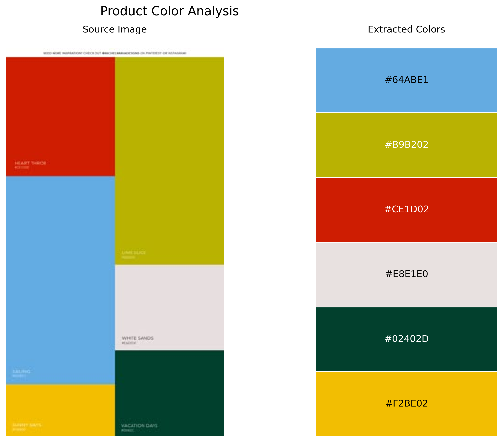

# ColorSnap 🎨

Extract and visualize dominant color palettes from images using K-means clustering.

## Features

- Extract the most dominant colors from any image
- Customize the number of colors to extract
- Get colors in multiple formats (RGB, normalized RGB, HEX)
- Generate beautiful visualizations of extracted palettes
- Save palettes as JSON for use in other applications
- Simple command-line interface
- Easy-to-use Python API

## Installation

```bash
# Install from PyPI
pip install colorsnap

# Install from source
git clone https://github.com/miaomiaoyv/colorsnap.git
cd colorsnap
pip install -e .
```

## Command-line Usage

```bash
# Basic usage
colorsnap path/to/image.jpg

# Extract 8 colors
colorsnap path/to/image.jpg -n 8

# Specify custom output directory
colorsnap path/to/image.jpg -o my-palettes

# Skip visualization
colorsnap path/to/image.jpg --no-viz

# Get help
colorsnap --help
```

## Python API Usage

```python
from colorsnap import ColorSnap
from PIL import Image

# Basic usage
extractor = ColorSnap()
results = extractor.process_and_save("path/to/image.jpg")

# Custom number of colors
extractor = ColorSnap()
palette = extractor.extract_from_path("path/to/image.jpg", n_colors=8)

# From PIL Image
image = Image.open("path/to/image.jpg")
extractor = ColorSnap(output_dir="my-palettes")
palette = extractor.extract_from_image(image, n_colors=10)

# Create visualization
extractor.create_visualization(image, palette, output_filename="my_palette.png")

# Access the colors
rgb_colors = palette["colors"]  # List of [R, G, B] values (0-255)
rgb_normalized = palette["colors_norm"]  # List of [R, G, B] values (0-1)
hex_colors = palette["colors_hex"]  # List of hex color codes
```

## Example Output

The tool generates:

1. A color palette visualization showing the source image and extracted colors:
   

2. A JSON file with color values:

    ```json
    {
        "colors": [[255, 192, 30], [40, 120, 200], ...],
        "colors_norm": [[1.0, 0.753, 0.118], [0.157, 0.471, 0.784], ...],
        "colors_hex": ["#ffc01e", "#2878c8", ...]
    }
    ```

## Use Cases

- Web design: Quickly extract colors from brand images
- Graphic design: Build cohesive color schemes from reference images
- Data visualization: Create color palettes that match your branding
- Interior design: Extract colors from inspiration images
- Fashion: Analyze color trends from fashion photography

## License

MIT License

## Contributing

Contributions are welcome! Please feel free to submit a Pull Request.
